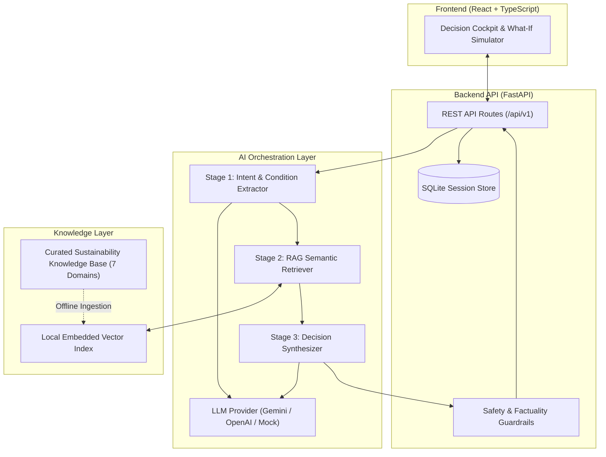

# RELOOP AI
### AI-Powered Circular Product Decision Intelligence

---

## 1. Executive Summary & Problem Statement

Every year, millions of tons of functional or repairable consumer products are prematurely sent to municipal recycling facilities or landfills. While municipal recycling is commonly perceived as the environmentally responsible default, in the **Circular Economy Waste Hierarchy**, material recycling is the *last line of defense* prior to disposal: melting, shredding, and remanufacturing downcycles materials, consumes massive energy, and discards intact component utility.

**RELOOP AI** is an AI-powered circular product decision-support system that answers the critical question:
> **"Should this product be discarded at all, and what is its highest-utility, most appropriate sustainable next life?"**

Rather than functioning as a simplistic recycling chatbot or a rigid collection of if-else rules, Reloop AI utilizes **real LLM reasoning combined with Retrieval-Augmented Generation (RAG)** over a curated sustainability knowledge base. It prioritizes **Product Life Extension (PLE)**—repairing, continuing use, reusing, donating, or repurposing—before recommending recycling.

---

## 2. Supported Circular Pathways

Ranked in order of product utility and ecological retention:

1. **Continue Using**: Non-invasive maintenance, cleaning, firmware reset, or software optimization when the product is fundamentally functional.
2. **Repair**: Component replacement, soldering, patching, or re-securing wobbly joints to restore full primary utility.
3. **Reuse**: Direct resale or peer-to-peer transfer when the current owner no longer needs it but the product is fully usable.
4. **Donate**: Giving to vetted non-profits, libraries, or community groups meeting specific condition criteria.
5. **Repurpose**: Creative upcycling or reassigning the product to a functional secondary role (e.g. using an old tablet as a smart-home dashboard).
6. **Recycle**: Certified e-waste or textile processing for material recovery when repair is unsafe, impossible, or uneconomical.

---

## 3. Key Architectural Features

- **Decoupled AI Orchestration**: Modular 3-stage intelligence pipeline:
  1. *Extraction*: Natural language diagnostic triage to identify product category, age bracket, functional state, and safety risks.
  2. *Retrieval*: Semantic vector search over curated domain knowledge with category filtering.
  3. *Reasoning Synthesis*: Structured LLM generation producing ranked pathways, confidence metrics, missing information disclosures, and step-by-step action roadmaps.
- **Strict Evidence Grounding**: The system is forbidden from fabricating environmental impact statistics (no ungrounded CO2/water/financial claims). Recommendations must cite retrieved knowledge documents.
- **Responsible AI & Safety Guardrail**: Automatic hazard detection for swollen lithium-ion batteries, high-voltage circuitry, and hazardous chemicals, immediately suppressing unsafe DIY suggestions and flagging certified drop-offs.
- **Interactive "What-If" Exploration**: Allows users to alter conditions (e.g., "What if I can't find replacement parts?" or "What if repair costs > $50?") and observe dynamic re-evaluations.
- **Provider-Agnostic LLM Engine**: Supports Gemini, OpenAI, Claude, Groq, Ollama, and an offline **Deterministic Mock Client** for reproducible zero-cost grading and continuous integration.

---

## 4. System Architecture

---

## 5. Curated Knowledge Base Categories

The system includes curated, structured knowledge base documents derived from reputable organizations (iFixit, US EPA, Ellen MacArthur Foundation, European Environmental Bureau, WRAP UK):

1. **Laptops & Portable Computers**
2. **Smartphones & Tablets**
3. **Consumer Electronics** (Headphones, speakers, e-readers, gaming peripherals)
4. **Clothing & Textiles** (Natural vs. synthetic fibers, seam mending, patching, donation thresholds)
5. **Books & Paper Media** (Preservation, mold remediation, community exchanges)
6. **Furniture & Woodwork** (Solid timber vs. particle board joinery, refinishing)
7. **Small Household Appliances** (Heating elements, motor clutches, descaling, cord safety)

---

## 6. Evaluation Framework

Reloop AI includes a formal machine-readable benchmark suite (`backend/tests/evaluation_cases.json`) consisting of **50 representative test cases** covering all 7 categories and complex edge cases (safety hazards, ambiguous descriptions, high repair cost trade-offs).

### Evaluated Dimensions
1. **Product Understanding**: Correct extraction of category, condition severity, and defects.
2. **Retrieval Relevance**: Precision and category alignment of retrieved knowledge chunks.
3. **Recommendation Quality**: Circular waste hierarchy alignment (life extension prioritization).
4. **Evidence Grounding**: Factual attribution to retrieved sources.
5. **Unsupported-Claim Rate**: Target $0\%$ ungrounded numeric statistics (zero-tolerance for hallucinated carbon claims).
6. **Uncertainty Handling**: Explicit disclosure of ambiguous inputs and missing diagnostic parameters.
7. **Response Consistency**: Semantic stability under input paraphrasing.

---

## 7. UN Sustainable Development Goals (SDG) Alignment

- **Primary: SDG 12 — Responsible Consumption and Production**
  - Specifically Target 12.5: *"By 2030, substantially reduce waste generation through prevention, reduction, recycling and reuse."*
  - Reloop AI directly operationalizes Target 12.5 by guiding consumers toward repair, refurbishment, and secondary use before disposal.
- **Secondary: SDG 11 — Sustainable Cities and Communities**
  - Supporting municipal solid waste reduction and local circular loops (repair cafés, tool libraries, and non-profit donation streams).

---

## 8. IBM BOB SDLC Integration

IBM BOB was utilized as an AI pair programmer and software engineering assistant throughout the 9 phases of the system development lifecycle:

| SDLC Phase | Documented IBM BOB Activity |
| :--- | :--- |
| **Requirements Analysis** | Validated circular hierarchy against WRAP/Ellen MacArthur frameworks. |
| **Architecture Planning** | Reviewed interface boundaries between FastAPI, AI orchestrator, and local RAG retriever. |
| **Implementation** | Assisted in generating Pydantic schemas, TypeScript types, and indexing routines. |
| **Debugging** | Assisted in debugging asynchronous pipeline latency and vector distance tuning. |
| **Testing** | Generated unit test assertions and synthetic benchmark scenarios. |
| **Code Review** | Scanned for code smells, anti-patterns, and strict typing adherence. |
| **Security Review** | Evaluated prompt injection mitigations and input sanitization boundaries. |
| **Documentation** | Drafted OpenAPI descriptions and architectural guides. |
| **Refactoring** | Modularized prompt templates into structured schema-bound formatters. |

*(Note: IBM BOB is utilized strictly as a development lifecycle tool and is not part of the runtime AI decision engine).*

---

## 9. Technology Stack

- **Frontend**: React 18, TypeScript, Vite, Vanilla/Modern CSS Design System
- **Backend**: Python 3.11+, FastAPI, Uvicorn, Pydantic v2
- **Database**: SQLite with `aiosqlite` (WAL mode enabled)
- **RAG & Vector Search**: Embedded Local Vector Store (ChromaDB / SQLite-vec) with local embeddings
- **AI / LLM Layer**: Extensible Provider Abstraction (Google Gemini, OpenAI, Claude, Local Ollama, Deterministic Mock)
